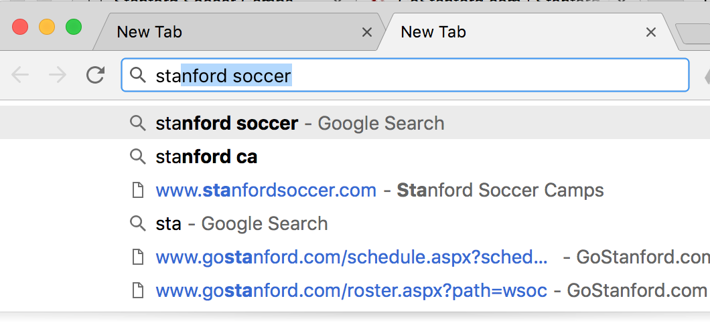
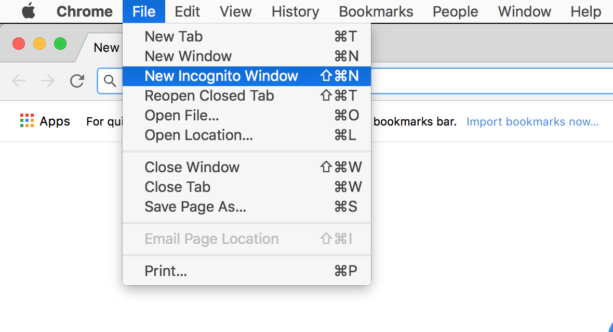
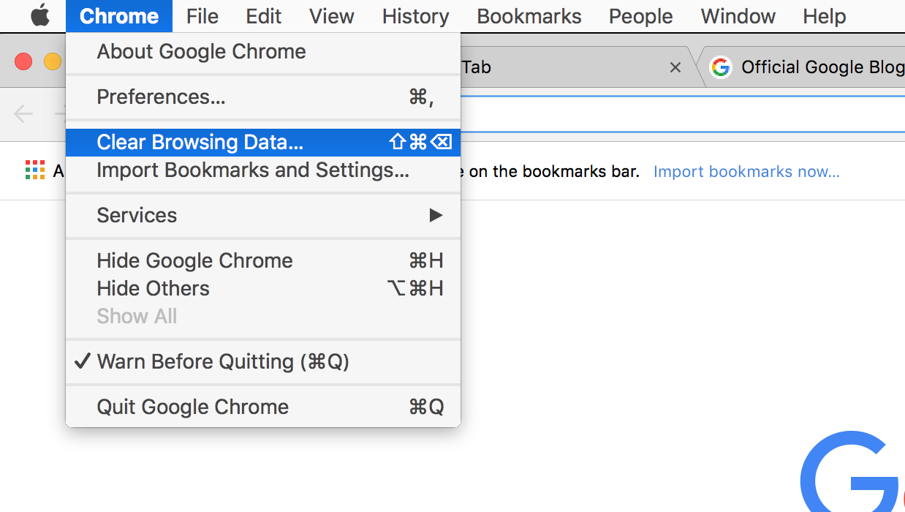
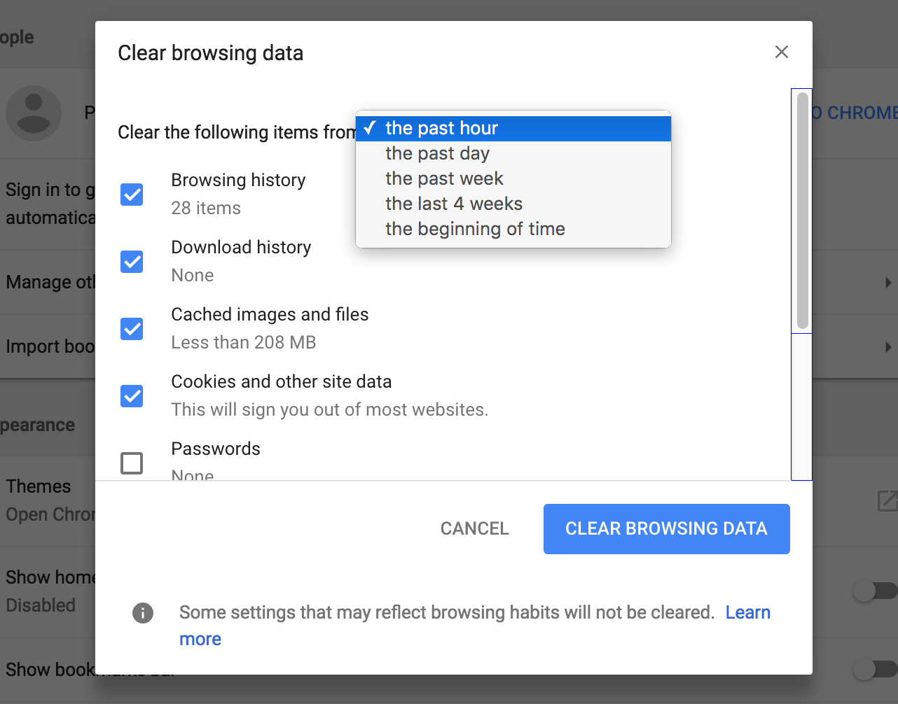
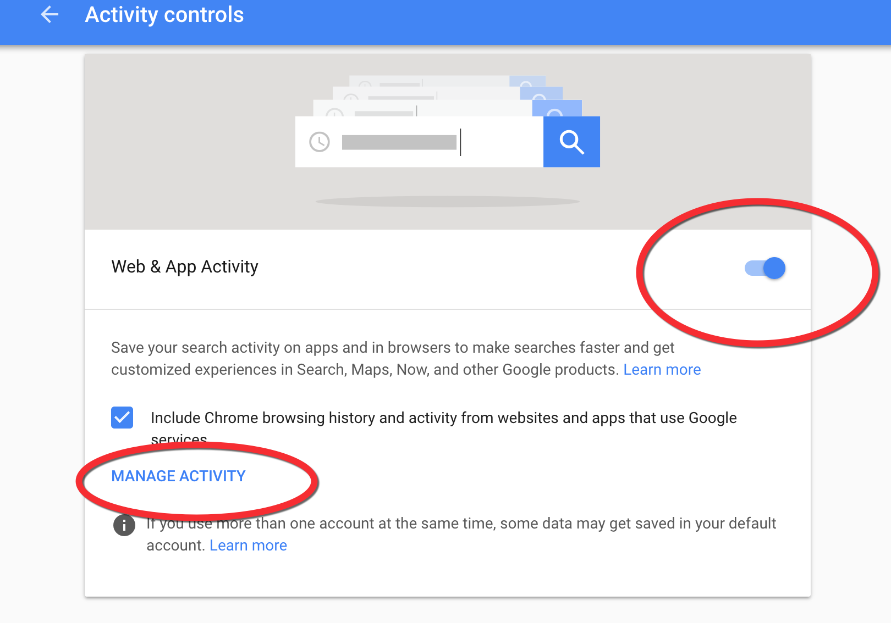
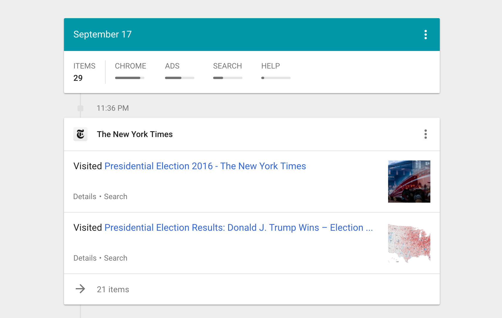
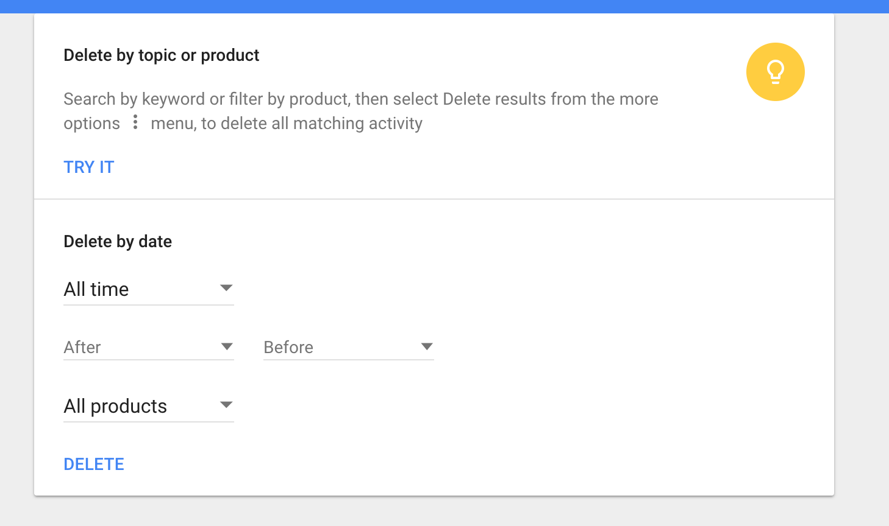

De-personalizing Google search
==============================

Google's search results have been `tailored to your account and personal activity since at least 2005 <https://googleblog.blogspot.com/2005/06/search-gets-personal.html>`_. This means that past search history is used to predict what you're interested in. Over the years, Google considers your activity on other Google platforms such as YouTube and GMail.

The most obvious manifestation of this can be seen in Google autocomplete, especially if you're using Chrome. If you've searched in the past for ``stanford soccer``, Google will assume in subsequent searches beginning with ``stanford``, that you're again interested in *soccer*, as opposed to a more popular sport like *football*, or *stanford shopping center*.

Besides your account activity, Google and Google Chrome are able to discern other information about you, including:

Incognito mode
--------------

Going into **Incognito Mode** might not affect how Google treats you and what results it serves up. Ostensibly, it at least lets you browse the web without adding to your account history.

For Chrome and Safari, the keyboard shortcut for launching a new browser instance in Incognito Mode is:

:kbd:`Command (or Ctrl) + Shift + n`

For Firefox, it's the same, except :kbd:`p` ("p" for "private") instead of :kbd:`n`

In Incognito Mode, the browser color scheme might darken. At the very least, you should see a privacy icon in the **right corner** of the browser to remind you.

.. image:: files/images/private-browser-icon.png

You can read more about the caveats of `Incognito Mode on Google's support site <https://support.google.com/chrome/answer/7440301>`_ -- basically assume that everything is still visible at least to your Internet Service Provider (and law enforcement) but Google won't (ostensibly) keep a log of your activity:

    When you browse privately, other people who use the device won't see your activity.

    Chrome doesn't save your browsing history or information entered in forms. Cookies and site data are remembered while you're browsing, but deleted when you close Incognito mode.

Deleting browsing history
-------------------------

For a given browser, your past visits to Stanford Soccer webpages is tracked in the **browser history**. This history is specific to your browser, though if you're using Chrome, there's the option to sync this data across all the different computers that you use Chrome on.

In Chrome, the **Clear Browsing Data...** action is under the **Chrome** menu item:

Deleting browsing history and download history is generally sufficient, especially if you find the browser's "autofill" for passwords convenient on a day-to-day basis:

Controlling and deleting Google account activity
------------------------------------------------

Since browser history can be synced across devices -- i.e. be stored in the "cloud" -- it's one of the datasets assciated with your **Google account history, or what Google describes as **My Activity**, which you can visit (while logged in) at the following URL:

https://myaccount.google.com/activitycontrols

Some of the kinds of activity that you can review, control, and delete, include:

- Your Google searches
- Your location history
- What you've searched for on YouTube
- What you've watched on YouTube

Switching the toggle controls whether or not you want Google to keep tracking your activity. Click the ``MANAGE ACTIVITY`` link to see what Google has tracked so far:

Clicking the hamburger icon in the left corner will bring up a submenu, including **Delete activity**:

.. image:: files/images/web-activity-history-sidebar-delete.png

Like browser activity, you're given options on what you want to delete. It's not always the case that you want to erase *everything*, but the optin is there:

You can find more official documentation on Google's support site:

- `Search and browse privately <https://support.google.com/websearch/answer/4540094>`_
- `Clear browsing data <https://support.google.com/chrome/answer/2392709>`_
- `Delete searches & other activity from your account <https://support.google.com/websearch/answer/465>`_
- `View and control activity on your account <https://support.google.com/accounts/answer/7028918>`_
- `Google's Privacy Policy <https://www.google.com/intl/en/policies/privacy/>`_
